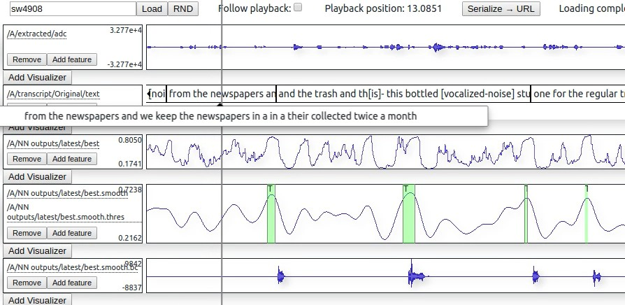
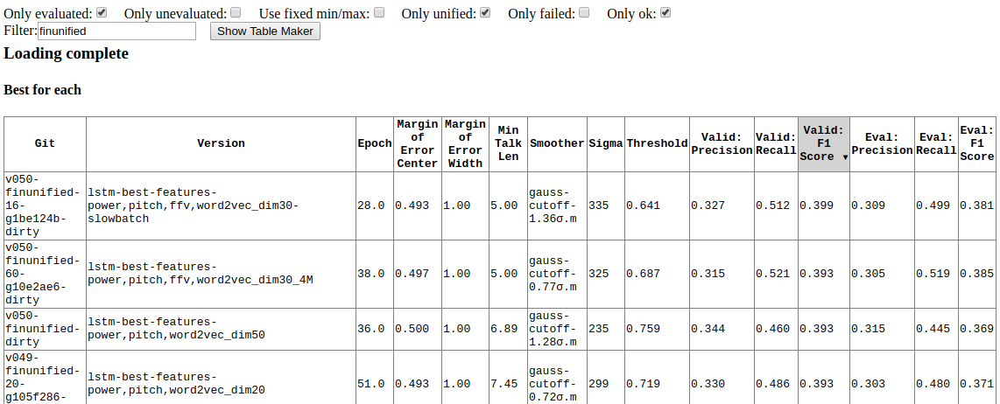
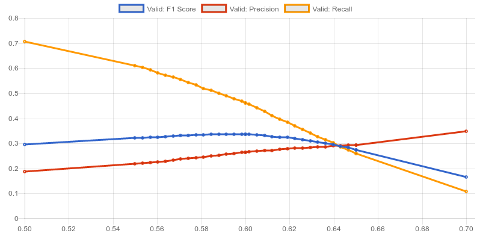

# Backchannel Prediction for Conversational Speech Using Recurrent Neural Networks 

Backchannels are short responses humans do to indicate attention to a speaker, like 'yeah', 'right', or 'uh-huh'. This project tries to predict good timings for these responses using the speaker audio data, thus creating an "AI" that pretends to listen.

This repository contains the code for [my bachelor's thesis](https://github.com/phiresky/bachelor-thesis) and the corresponding papers:

* [Yeah, Right, Uh-Huh: A Deep Learning Backchannel Predictor](https://arxiv.org/abs/1706.01340) ([IWSDS 2017](https://www.uni-ulm.de/in/iwsds2017/general/introduction/))
* [Enhancing Backchannel Prediction Using Word Embeddings](http://www.isca-speech.org/archive/Interspeech_2017/abstracts/1606.html) ([Interspeech 2017](http://www.interspeech2017.org/))


## Demo

1. Sample on the evaluation data set: [](https://streamable.com/0woc)
2. Another sample on the evaluation data set: https://streamable.com/eubh
3. Live system demo (from microphone input): https://streamable.com/dycu1

Demo docker container:

    sudo docker run -p 3000:3000 -p 8765:8765 -ti phiresky/backchanneler-live-demo

Then open <http://localhost:3000> in the browser (loading takes a bit).

Includes the live demo (microphone input!) and some sample tracks from the Switchboard data set: sw2249, sw2258, sw2411, sw2485, sw273,  sw2807, w2254, sw2297, sw2432, sw2606, sw2762, sw4193. Selecting other tracks will fail.

## Setup

The final configurations are in [configs/finunified](configs/finunified). All of the ones in `vary-*` are generated with *configs/meta_config_generator.ts*.

### Get the data

See [data/README.md](data/README.md) for more details.

### Build Janus

The Janus speech recognition toolkit (used here for only for extracting pitch data) should be open source by the end of 2017.

```bash
cd janus
mkdir build && cd build
cmake ..
make -j$(nproc)
sudo python setup.py develop
```

## Reproducing the results of the paper

You can reproduce the results of the paper using the script [scripts/reproduce.sh](scripts/reproduce.sh).

Note that this may take a long time (~3h to extract the data (only once), ~2h to train one LSTM, 1h to evaluate it).

## Meta config generator

Generates configurations from a set of combinations 

Run this from the project root:

    ts-node --fast configs/meta_config_generator.ts
   
The best network configuration according to the objective evaluation is

    configs/finunified/vary-features/lstm-best-features-power,pitch,ffv,word2vec_dim30.json


## Data Visualizer

See the _Demo_ section for screenshots.

Server is in /web_vis/py/

Run this from the project root:

    python -m web_vis.py.server extract/config.json

Client is in /web_vis/ts/

Run this from the folder /web_vis/ts/

    yarn run dev

This will start a webserver serving the client at <http://localhost:3000>, which will connect to the server via websockets at localhost:8765.

## Extraction

The main script for extraction is extract/readDB.py. Run it via

    export JOBS=4 # run in parallel
    python -m extract.readDB configs/...
   
Note that the extraction will also be run automatically when before training when necessary, with all the results being cached. The `data/cache` folder will grow to about 10-20 GByte.

## Training

## Evaluation Visualizer

Screenshots: 

Objective evaluation comparison: 
Training graphs: 
The effect of changing the trigger thresold on Precision, Recall and F1-Score ratings: 

You can see an instance of the Evaluation Visualizer online at https://phiresky.github.io/backchannel-prediction/evaluate/plot/dist/?filter=%22finunified%22 (warning: slow and unoptimized)


Build it and run the server

    cd evaluate/plot
    yarn
    yarn run dev

Then go to <http://localhost:8080/evaluate/plot/dist/>

## Technical details

You can see more information in `Section 6: Implementation` of my bachelor's thesis, see here: https://github.com/phiresky/bachelor-thesis/blob/master/build/thesis.pdf
